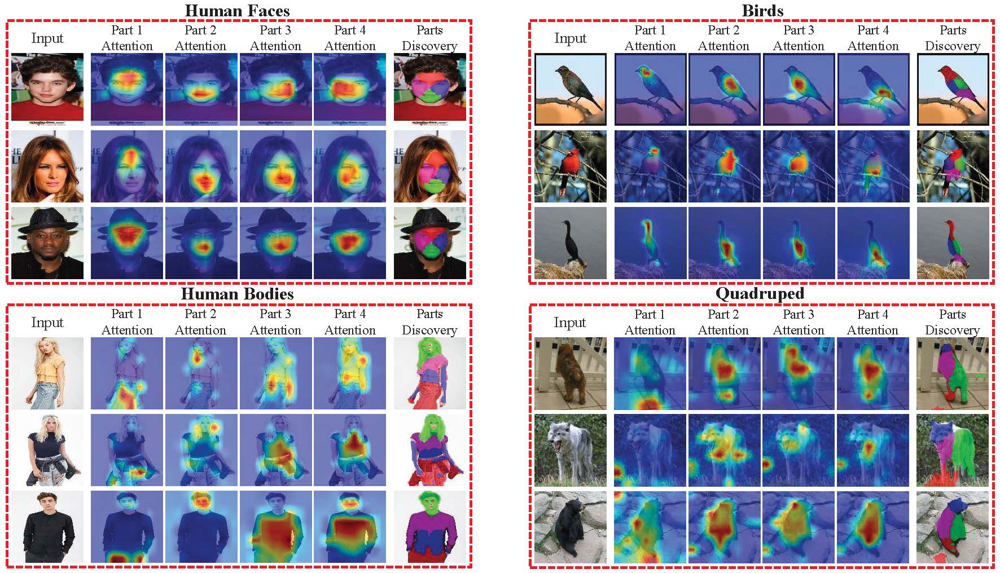

#  Unsupervised Part Discovery via Dual Representation Alignment
Pytorch training and evaluation codes for unsupervised part discovery.



## Installation

Install python dependencies

```
pip3 install -r requirements.txt
```

Download [pretrained backbone](https://dl.fbaipublicfiles.com/dino/dino_deitsmall8_pretrain/dino_deitsmall8_pretrain.pth)

Move the pretrained backbone weight to ```./pretrain```

## Run training and Evaluation on CelebA
1. Download and process CelebA dataset
    * Download CelebA dataset and annotation from [Here](https://drive.google.com/drive/folders/0B7EVK8r0v71pWEZsZE9oNnFzTm8?resourcekey=0-5BR16BdXnb8hVj6CNHKzLg).
    * Move img files into ```./Dataset/CelebA/img_celeba``` directory. Your directory should look like this:
        ```
        Unsupervised_Part
        └─── Dataset
           └─── CelebA
              └─── cele_train_lm.txt
              └─── MAFL_test_lm.txt
              └─── MAFL_train_lm.txt
              └─── img_celeba
                  └─── 000001.jpg
                  │
                  └─── ...
        ```
2. To train the model on CelebA, you need to change ```_C.DATASET.DATASET``` to ```CelebA```, ```_C.TRAIN.LR_STEP``` to ```[10, 13]```, ```_C.TRAIN.NUM_EPOCH``` to ```15```
 in ```./Config/default.py``` 
   ```
   python train.py
   ```
   We also provide the [pretrained model](https://drive.google.com/file/d/1P_lGX8wFn11a9Ky01YYBwMAfktCFvzzj/view?usp=drive_link) .
3. To evaluate the trained model
   ```
    python CelebA_NMI.py --checkpoint=<model_path>
    For example: python CelebA_NMI.py --checkpoint=./Model/CelebA_K4.pth
    ```

## Run training and Evaluation on CUB
1. Download and process CUB dataset
    * Download CUB dataset and annotation from [Here](https://www.vision.caltech.edu/datasets/cub_200_2011/).
    * Move img files into ```./Dataset/CUB/images``` directory. Your directory should look like this:
        ```
        Unsupervised_Part
        └─── Dataset
           └─── CUB
              └─── train_list.txt
              └─── test_list.txt
              └─── bounding_boxes.txt
              └─── parts
              │   └─── part_locs.txt
              └─── images
                  └─── 001.Black_footed_Albatross
                  │
                  └─── ...
        ```
2. To train the model on CUB, you need to change ```_C.DATASET.DATASET``` to ```CUB```, ```_C.TRAIN.LR_STEP``` to ```[90, 95]```, ```_C.TRAIN.NUM_EPOCH``` to ```100```
 in ```./Config/default.py```
   ```
   python train.py
   ```
   We also provide the [pretrained model](https://drive.google.com/file/d/1N6wRkfjaUJGNtSr9ybkNEsg1DJ1SX61N/view?usp=sharing) .
3. To evaluate the trained model
   ```
    python CUB_NMI.py --checkpoint=<model_path>
    For example: python CUB_NMI.py --checkpoint=./Model/CUB.pth

## Run training and Evaluation on PartImageNet
1. Download and process PartImageNet dataset
    * Download PartImageNet dataset and annotation from [Here](https://github.com/TACJu/PartImageNet).
    * Prepare this dataset as [PDiscoNet](https://github.com/robertdvdk/part_detection)
    * Move img files into ```./Dataset/PartImageNet_Processed/``` directory. Your directory should look like this:
        ```
        Unsupervised_Part
        └─── Dataset
           └─── PartImageNet_Processed
              └─── newdset.txt
              └─── label_2_supercategory.json
              └─── train.json
              └─── train_train
              │   └─── n01440764
              │   │
              │   └─── ...
              └─── train_test
                  └─── n01440764
                  │
                  └─── ...
        ```
2. To train the model on PartImageNet, you need to change ```_C.DATASET.DATASET``` to ```PartImage```, ```_C.TRAIN.LR_STEP``` to ```[180, 190]```, ```_C.TRAIN.NUM_EPOCH``` to ```200```
 in ```./Config/default.py```
   ```
   python train.py
   ```
   We also provide the [pretrained model](https://drive.google.com/file/d/1_yUW-RE6Pfk7dTYWmDtMVuI8wpvsnO45/view?usp=sharing).
4. To evaluate the trained model
   ```
    python PartImage_NMI.py --checkpoint=<model_path>
    For example: python PartImage_NMI.py --checkpoint=./Model/PartImage.pth
   ```
   
## Citation
If you find this work or code is helpful in your research, please cite:
```
@ARTICLE{Unsupervised_Part,
  author={Jiahao, Xia and Wenjian, Huang and Min, Xu and Jianguo, Zhang and Haimin, Zhang and Ziyu, Sheng and Dong, Xu},
  journal={TPAMI}, 
  title={Unsupervised Part Discovery via Dual Representation Alignment}}
```

## License
This code is released under the GPL-2.0 license. Please see the [LICENSE](LICENSE) file for more information.
